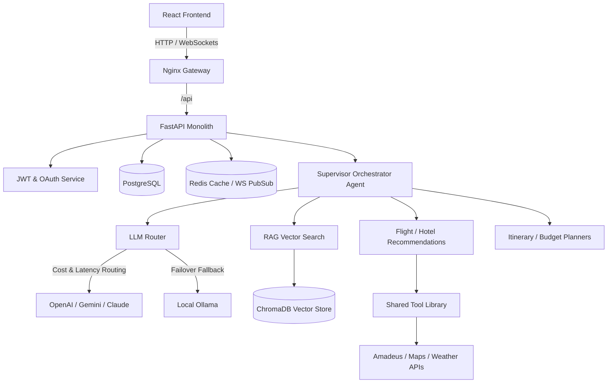

# Ghumne Chale — AI-First Travel Operating System

Ghumne Chale is a unified booking, pricing, and conversational itinerary planning system powered by a multi-agent orchestration graph (built with LangGraph) and a custom LLM Router with circuit-breaker capabilities and automatic failover.

---

## System Architecture



### Request Lifecycle Flow Example

Here is how a conversational request (e.g., *"Book a flight to Goa under ₹10,000"*) travels through the system:

1. **Frontend (React)**: The user types the message in the conversational AI panel. The client initiates a WebSocket connection (or SSE stream) to `/api/v1/agents/chat`.
2. **Gateway (Nginx)**: Directs the WebSocket traffic to the `backend-fastapi` service.
3. **Controller (FastAPI Route)**: Verifies the JWT token in the WebSocket connection header, retrieves the session, and triggers the `Supervisor Agent` entry point.
4. **Supervisor (Orchestrator)**:
    - Retreives past session messages from Redis (short-term memory) and user profiles from ChromaDB (long-term preferences).
    - Classifies user intent (in this case, Flight Planning/Booking).
    - Dispatches a sub-task to the `Flight Search Agent` state graph.
5. **Flight Search Agent**:
    - Invokes `flight_search_tool` with arguments extracted from the request.
6. **Tool Layer (Shared Tool Library)**:
    - `flight_search_tool` checks the Redis cache for previous queries. If cached, it returns immediately.
    - If cache-miss, it makes a rate-limited HTTP request to the external **Amadeus API**.
    - If the Amadeus API fails, the tool handles it gracefully (retrying with exponential backoff) or fails back to a standardized error tuple.
7. **LLM Router**:
    - The `Flight Search Agent` passes the API results to the `LLM Router` to structure and rank them.
    - The Router checks provider latency scores in Redis, verifies that OpenAI is active (circuit breaker not tripped), and sends the payload.
    - The response is streamed token-by-token back to the agent.
8. **Streamed Response back to User**:
    - The agent yields structural state updates (e.g., `{"status": "searching_flights"}`) followed by token streams.
    - FastAPI streams these tokens over the WebSocket directly to the React frontend, where they are rendered in real time.

---

## Local Setup

### Prerequisites
- Docker & Docker Compose
- Node.js (v18+)
- Python (v3.10+)

### Launching Environment
1. Copy and configure variables:
   ```bash
   cp .env.example .env
   ```
2. Start infrastructure:
   ```bash
   docker-compose up -d
   ```
=======
# Make-My-Trip
Full-stack AI-first travel booking platform (MakeMyTrip-inspired) — 12 booking verticals, LangGraph multi-agent assistant, multi-provider LLM router with failover, and an admin-approved booking pipeline with a standalone approval console.
# Ghumne Chale

**A full-stack, AI-first travel booking platform inspired by MakeMyTrip —
built to explore production-grade patterns in multi-agent AI systems,
marketplace operations, and trust/risk workflows.**

Ghumne Chale isn't just another booking-form clone. It's a complete travel
super-app covering 12 booking verticals, a conversational AI layer built on
a real multi-agent architecture, and an operations layer (admin approvals,
fraud review, refund processing, payouts) modeled after how production
travel platforms actually manage risk at scale.

---

## Table of Contents

- [Overview](#overview)
- [Features](#features)
- [Architecture](#architecture)
- [Tech Stack](#tech-stack)
- [AI Agent System](#ai-agent-system)
- [Booking & Approval Flow](#booking--approval-flow)
- [Project Structure](#project-structure)
- [Getting Started](#getting-started)
- [Environment Variables](#environment-variables)
- [Screenshots](#screenshots)
- [Roadmap](#roadmap)
- [Design Decisions](#design-decisions)
- [Contributing](#contributing)
- [License](#license)

---

## Overview

Ghumne Chale is a monorepo containing:

- **`frontend-react`** — the customer-facing booking app (search, browse,
  book, manage trips, chat with the AI assistant)
- **`admin-console`** — a standalone admin frontend, deployed and served
  independently, for booking approvals, refund processing, fraud review,
  content management, and analytics
- **`backend-fastapi`** — the core API: auth, search, booking, payments,
  the LLM router, and the agent orchestration layer
- **PostgreSQL + Redis + ChromaDB** — relational data, caching/session/
  real-time state, and vector storage for RAG and agent memory

The project was built incrementally as a portfolio/learning project, with
each subsystem (search, booking, payments, AI agents, admin operations)
designed to mirror how a real travel company would structure it — not just
enough to make a demo work, but enough to reason about scale, risk, and
maintainability.

---

## Features

### Booking
- 12 verticals: **Flights, Hotels, Villas & Homestays, Holiday Packages,
  Trains, Buses, Cabs, Tours & Attractions, Visa, Cruise, Forex Card &
  Currency, Travel Insurance**
- Unified search gateway with a single client-facing API across all
  verticals, backed by vertical-specific read-optimized indexes
- Real-time availability with race-condition-safe holds (Redis
  distributed locks / row-level locking)
- Dynamic, demand-based pricing with a short-TTL price lock at checkout
- Special fares (Student, Senior Citizen, Armed Forces, GST/Business),
  Price Drop Protection, and unlimited/metered mileage-style plans where
  applicable
- Digital KYC and document verification pipeline (shared across bookings,
  Forex, and Visa applications)
- Wishlist, saved travelers, saved payment methods, wallet, and loyalty
  points/tiers

### AI Assistant
- Conversational trip planning ("Plan a Goa trip under ₹25,000") powered
  by a **Supervisor Agent** that routes and chains specialist agents
- Specialist agents for flight/hotel search, budget planning, itinerary
  generation, price prediction, visa requirements, weather, currency,
  local recommendations, fraud detection, and customer support
- **RAG-grounded answers** (ChromaDB) for cancellation policies, visa
  rules, and FAQs — with source attribution, not hallucinated policy
  advice
- **Multi-provider LLM router** (OpenAI / Claude / Groq / local Ollama)
  with cost- and latency-aware routing, circuit breakers, and automatic
  failover to a local model if every cloud provider is unavailable
  mid-conversation
- Streaming responses with structured, renderable output (flight cards,
  itinerary views, price-trend charts) — not just plain text

### Payments & Trust
- Gateway-abstracted payments (Stripe/Razorpay-style), tokenized payment
  methods, 3DS/step-up support, split wallet+card payments
- **Every booking is authorized, not captured, until admin approval** —
  configurable auto-approval rules mean routine low-risk bookings confirm
  instantly, while flagged or high-value bookings route to a human
- Immutable ledger with scheduled reconciliation against gateway
  settlement reports
- Fraud-review queue, dispute/chargeback handling, and vendor payout
  processing, all through one unified admin approval system
- Cancellation-policy engine computing transparent, explainable refund
  amounts, with a manual-override path for exceptions

### Admin Console (standalone)
- Deployed as its own frontend, on its own subdomain, hitting the same
  backend under a CORS-restricted `/api/admin/*` namespace with separate
  role-scoped auth
- Real-time booking-approval and refund queues (WebSocket-fed)
- Payments dashboard, content management (offers, partner showcases,
  curated collections), fraud/dispute review, and a searchable audit log

---

## Architecture

```
                        ┌─────────────────────┐
                        │      nginx / CDN     │
                        └──────────┬───────────┘
              ┌─────────────────────────────────────┐
              │                                       │
     ┌────────▼─────────┐                  ┌──────────▼──────────┐
     │  frontend-react   │                  │    admin-console     │
     │ (customer app)    │                  │ (standalone, own      │
     │                    │                  │  subdomain/server)    │
     └────────┬─────────┘                  └──────────┬──────────┘
              │            /api/*  and  /api/admin/*               │
              └───────────────────────┬──────────────────────────┘
                                       │
                          ┌────────────▼────────────┐
                          │      backend-fastapi      │
                          │  routes / services /       │
                          │  repositories / ai_agents / │
                          │  llm_router / payments /    │
                          │  memory / rag                │
                          └───┬─────────┬──────────┬────┘
                              │         │          │
                   ┌──────────▼──┐ ┌────▼────┐ ┌────▼─────┐
                   │ PostgreSQL   │ │  Redis  │ │ ChromaDB │
                   │ (bookings,   │ │(cache,  │ │ (RAG +   │
                   │  ledger,     │ │ session,│ │  agent   │
                   │  users)      │ │ locks)  │ │  memory) │
                   └──────────────┘ └─────────┘ └──────────┘
```

Key architectural decisions:

- **Shared booking core** — every vertical's booking model composes a
  common state machine (`HOLD → PENDING_ADMIN_APPROVAL → CONFIRMED →
  ACTIVE → COMPLETED`, with `REJECTED`/`CANCELLED`/`REFUNDED` branches)
  instead of each vertical reimplementing its own booking lifecycle.
- **One LLM router, every agent goes through it** — no agent calls a
  provider SDK directly, so provider failover, cost tracking, and
  circuit-breaking are handled in exactly one place.
- **Admin console is architecturally separate**, not just a route behind
  an auth check — separate build, separate deploy target, separate CORS
  origin, separate auth scope. This was a deliberate choice to model how
  production systems isolate high-privilege tooling from the public
  surface.

---

## Tech Stack

| Layer          | Technology |
|----------------|------------|
| Frontend       | React, Vite, TypeScript, Tailwind CSS, ShadCN UI, Framer Motion |
| Backend        | FastAPI (Python) |
| Database       | PostgreSQL |
| Cache / Queue  | Redis, Celery |
| Vector Store   | ChromaDB |
| AI Orchestration | LangChain, LangGraph |
| LLM Providers  | OpenAI, Anthropic Claude, Groq, Gemini, Ollama (local fallback) |
| Payments       | Stripe / Razorpay (abstracted) |
| Realtime       | WebSockets |
| Infra          | Docker, Docker Compose, GitHub Actions (CI/CD), nginx |
| Observability  | Prometheus, Grafana, structured JSON logging |

---

## AI Agent System

Ghumne Chale uses a **Supervisor pattern**: a top-level Supervisor Agent
classifies intent and either answers directly, delegates to one specialist
agent, or chains several together for multi-step requests.

```
User: "Plan a Goa trip under ₹25,000"
        │
        ▼
  Supervisor Agent (intent: multi-step trip planning)
        │
        ├──▶ Budget Planning Agent    (splits ₹25,000 across flight/hotel/food)
        ├──▶ Flight Search Agent      (real flight options via flight_search_tool)
        ├──▶ Hotel Recommendation Agent (real hotel options + weather check)
        ├──▶ Itinerary Generator Agent (day-by-day plan)
        └──▶ Visa Assistant Agent     (skipped — domestic trip)
        │
        ▼
  Synthesized, streamed response with structured cards
```

Every agent:
- Calls the shared **LLM Router** (never a provider SDK directly)
- Uses a shared **tool library** (flight/hotel search, maps, weather,
  currency, places) instead of duplicating HTTP clients
- Draws on **short-term Redis memory** (this conversation) and
  **long-term ChromaDB memory** (past trips/preferences) for context
- Logs every call — tokens, latency, provider used, trace ID — for
  observability and cost analysis

---

## Booking & Approval Flow

```
 Search  ──▶  Detail/Configure  ──▶  Checkout (payment authorized)
                                            │
                                            ▼
                              PENDING_ADMIN_APPROVAL
                              (or auto-approved by rule)
                                    │            │
                              Approved      Rejected
                                    │            │
                                    ▼            ▼
                              CONFIRMED     Payment voided,
                              (captured)    inventory released,
                                    │        user notified
                                    ▼
                        ACTIVE → COMPLETED
                        (or CANCELLED → refund via
                         policy engine, admin-processed
                         for exceptions)
```

This flow is intentionally more conservative than a typical instant-book
demo — it's meant to demonstrate a realistic risk-management pattern, with
configurable auto-approval rules so routine bookings still confirm
instantly in practice.

---

## Project Structure

```
travel-os/
├── frontend-react/          # customer-facing app
│   ├── src/
│   │   ├── components/
│   │   ├── pages/
│   │   ├── search-forms/    # SearchFormRegistry — one form per vertical
│   │   └── chat/            # floating + full-page AI assistant UI
│   └── ...
├── admin-console/            # standalone admin frontend
│   ├── src/
│   │   ├── approvals/        # booking + refund approval queues
│   │   ├── payments/
│   │   ├── content/           # offers, partners, collections
│   │   └── analytics/
│   └── ...
├── backend-fastapi/
│   ├── routes/
│   ├── services/
│   ├── repositories/
│   ├── models/
│   ├── ai_agents/             # LangGraph agent graphs
│   ├── ai_tools/               # shared tool library
│   ├── llm_router/
│   ├── rag/
│   ├── memory/
│   ├── payments/
│   └── ...
├── packages/
│   └── shared-types/            # types shared between both frontends
├── docker-compose.yml
├── docker-compose.prod.yml
└── .github/workflows/
```

---

## Getting Started

### Prerequisites
- Docker & Docker Compose
- Node.js 20+ (for local frontend dev outside Docker)
- Python 3.11+ (for local backend dev outside Docker)

### Local Setup

```bash
# clone
git clone https://github.com/<your-username>/travel-os.git
cd travel-os

# copy env templates
cp backend-fastapi/.env.example backend-fastapi/.env
cp frontend-react/.env.example frontend-react/.env
cp admin-console/.env.example admin-console/.env

# fill in the required keys (see Environment Variables below)

# start everything
docker compose up --build
```

- Customer app: `http://localhost:5173`
- Admin console: `http://localhost:5174`
- API: `http://localhost:8000` (Swagger docs at `/docs`)

### Seeding demo data

```bash
docker compose exec backend python -m scripts.seed all
```

This populates reference data (cities, airports), sample inventory
(flights, hotels, etc.), offers/partners/collections, and a few demo user
accounts with booking history so the app doesn't look empty on first run.
Demo credentials are printed to the console after seeding.

---

## Environment Variables

At minimum, `backend-fastapi/.env` needs:

```
DATABASE_URL=
REDIS_URL=
CHROMA_URL=
JWT_SECRET=
GOOGLE_OAUTH_CLIENT_ID=
GOOGLE_OAUTH_CLIENT_SECRET=

# at least one LLM provider
OPENAI_API_KEY=
ANTHROPIC_API_KEY=
GROQ_API_KEY=
OLLAMA_BASE_URL=

# external integrations (optional, feature-gated)
AMADEUS_API_KEY=
GOOGLE_MAPS_API_KEY=
OPENWEATHER_API_KEY=
STRIPE_SECRET_KEY=
RAZORPAY_KEY_ID=
TWILIO_ACCOUNT_SID=
SENDGRID_API_KEY=
```

See `.env.example` in each service for the full list.

---

## Screenshots

> _Add screenshots or a short demo GIF here — homepage search, chat
> assistant in action, and the admin approval queue are the most
> compelling to show._

| Homepage Search | AI Assistant | Admin Approval Queue |
|---|---|---|
| _screenshot_ | _screenshot_ | _screenshot_ |

---

## Roadmap

- [ ] Voice assistant (Deepgram + ElevenLabs streaming)
- [ ] ML-based price prediction and fraud detection models (currently
      rule-based placeholders in some verticals)
- [ ] myBiz corporate travel module (approval workflows, centralized
      billing)
- [ ] Full test coverage (unit + integration + E2E) across all verticals
- [ ] Kubernetes manifests for production deployment

---

## Design Decisions

A few choices worth calling out, since they were deliberate rather than
defaults:

- **Admin approval is mandatory by default, with opt-in auto-approval
  rules** — rather than instant-confirm-by-default with after-the-fact
  fraud checks. This was chosen to demonstrate a more conservative,
  trust-first booking model, closer to how a real marketplace manages
  risk before it has years of trust data on its users.
- **One shared booking state machine across all 12 verticals**, with
  vertical-specific fields and policy overrides layered on top, instead of
  12 independent booking systems — this kept the codebase from
  fragmenting into inconsistent booking logic per vertical.
- **The admin console is a fully separate deployable app**, not a
  route behind a permission check in the main app — chosen to model
  proper isolation of high-privilege tooling, and to keep the customer
  app's bundle free of admin-only code.

---

## Contributing

This is currently a personal/portfolio project. Issues and suggestions are
welcome; PRs may be considered depending on scope. If you'd like to
contribute, please open an issue first to discuss what you'd like to
change.

---

## License

[Choose a license — MIT is a common default for portfolio projects]
```

---

*Built by [Your Name] as a portfolio project exploring full-stack AI
application architecture, multi-agent orchestration, and marketplace
trust/risk systems.*

