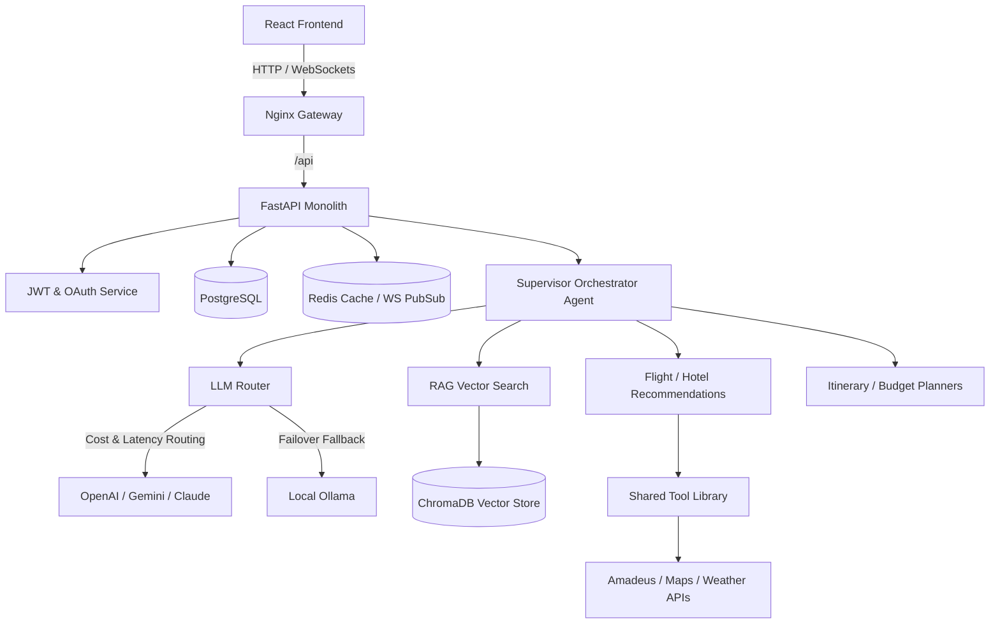

# Travel OS — AI-First Travel Operating System

Travel OS is a unified booking, pricing, and conversational itinerary planning system powered by a multi-agent orchestration graph (built with LangGraph) and a custom LLM Router with circuit-breaker capabilities and automatic failover.

---

## System Architecture



### Request Lifecycle Flow Example

Here is how a conversational request (e.g., *"Book a flight to Goa under ₹10,000"*) travels through the system:

1. **Frontend (React)**: The user types the message in the conversational AI panel. The client initiates a WebSocket connection (or SSE stream) to `/api/v1/agents/chat`.
2. **Gateway (Nginx)**: Directs the WebSocket traffic to the `backend-fastapi` service.
3. **Controller (FastAPI Route)**: Verifies the JWT token in the WebSocket connection header, retrieves the session, and triggers the `Supervisor Agent` entry point.
4. **Supervisor (Orchestrator)**:
    - Retreives past session messages from Redis (short-term memory) and user profiles from ChromaDB (long-term preferences).
    - Classifies user intent (in this case, Flight Planning/Booking).
    - Dispatches a sub-task to the `Flight Search Agent` state graph.
5. **Flight Search Agent**:
    - Invokes `flight_search_tool` with arguments extracted from the request.
6. **Tool Layer (Shared Tool Library)**:
    - `flight_search_tool` checks the Redis cache for previous queries. If cached, it returns immediately.
    - If cache-miss, it makes a rate-limited HTTP request to the external **Amadeus API**.
    - If the Amadeus API fails, the tool handles it gracefully (retrying with exponential backoff) or fails back to a standardized error tuple.
7. **LLM Router**:
    - The `Flight Search Agent` passes the API results to the `LLM Router` to structure and rank them.
    - The Router checks provider latency scores in Redis, verifies that OpenAI is active (circuit breaker not tripped), and sends the payload.
    - The response is streamed token-by-token back to the agent.
8. **Streamed Response back to User**:
    - The agent yields structural state updates (e.g., `{"status": "searching_flights"}`) followed by token streams.
    - FastAPI streams these tokens over the WebSocket directly to the React frontend, where they are rendered in real time.

---

## Local Setup

### Prerequisites
- Docker & Docker Compose
- Node.js (v18+)
- Python (v3.10+)

### Launching Environment
1. Copy and configure variables:
   ```bash
   cp .env.example .env
   ```
2. Start infrastructure:
   ```bash
   docker-compose up -d
   ```
