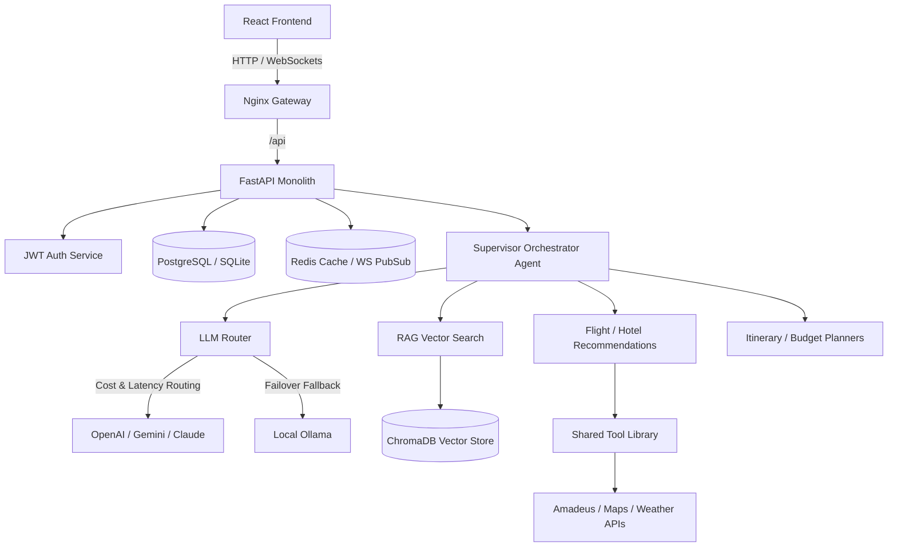

# Ghumne Chale — AI-First Travel Operating System

Ghumne Chale is a complete, unified travel booking, pricing, and conversational itinerary planning ecosystem. It is powered by a multi-agent orchestration graph (built with LangGraph) and a custom LLM Router with circuit-breaker capabilities and automatic local failover.

---

## Concise Feature List
- **Flight Booking**: Real-time pricing validation, seat holds, and special fare recalculation.
- **Train Booking**: Real-time availability checks and ticket provisioning.
- **Hotel Booking**: Room availability validation and booking confirmation vouchers.
- **Wallet**: Atomic debit/credits, transaction logging, filters, and safety balance checks.
- **Payments**: Gateway-abstracted payments with 1-click Razorpay Sandbox integration.
- **Loyalty & Cashback**: Dynamic membership tiers, points lifecycle, and automatic 5% confirmed booking cashback.
- **Group Trips**: Workspace collaboration, real-time sync, and document management.
- **Expenses & Settlement**: Equal, custom, and percentage expense splits with a greedy debt-simplification settlement engine.
- **AI Travel Assistant**: Contextual chatbot querying trip details, budgets, itineraries, and tasks.
- **Notifications**: Instant user-activity notifications with routing actions.
- **Analytics**: Real-time dashboard showing bookings, expenditures, and travel trends.
- **Document Management**: Verification vaults for travelers' digital files and identification records.

---

## System Architecture



### Request Lifecycle Flow
1. **Frontend (React)**: Client initiates connection to `/api/v1/agents/chat`.
2. **Controller (FastAPI)**: Validates JWT token, retrieves current session state, and triggers the `Supervisor Agent`.
3. **Supervisor Orchestration**: Extracts intent, accesses long-term memory (ChromaDB) and short-term cache (Redis), and delegates sub-tasks to Specialist Agents.
4. **Tools Layer**: Queries external APIs (Amadeus, OpenWeatherMap) with caching layers to avoid rate limits.
5. **Streaming**: Response tokens stream back to the UI in real-time over WebSocket connection.

---

## Tech Stack

* **Frontend**: React, Vite, TypeScript, Tailwind CSS, Lucide Icons, Leaflet Maps
* **Backend**: FastAPI (Python), SQLAlchemy ORM, Alembic
* **Database**: PostgreSQL (Production) / SQLite (Local Test)
* **Cache & Memory**: Redis
* **AI Orchestration**: LangGraph, ChromaDB Vector DB
* **Payments**: Razorpay (Sandbox) & Travel Wallet Ledger

---

## Wallet & Payment Architecture

```
[Booking Hold] ──▶ [Check Balance] ──▶ [Debit Wallet (Atomic)] ──▶ [Confirm Booking] ──▶ [Credit 5% Cashback]
```

* **Source of Truth**: All balance calculations reside on the server. The client balance is only updated after successful API responses.
* **Atomicity**: Transactions are wrapped in SQL database transactions. If confirmation fails, the wallet debit rolls back atomically.
* **Double-Spending Prevention**: Hold tokens and locks on PNRs prevent double payment submissions.
* **Cashback Engine**: A confirmed booking automatically awards 5% cashback to the user's wallet. Cashback is protected against double-claiming.

---

## Group Trip & Split Architecture
* **Collaborative Workspace**: Keeps members, itineraries, budgets, and bookings in sync. All changes trigger live notifications.
* **Expense Splits**: Supports:
  - **Equal Splits**: Evenly divides expenses among all group members.
  - **Custom Splits**: Assigns arbitrary decimal shares per traveler.
  - **Percentage Splits**: Ensures all shares add up exactly to 100%.
* **Greedy Settlement Engine**: Utilizes a greedy debt-simplification algorithm to minimize the total number of transactions needed to settle all debts.

---

## Environment Variables

Copy `.env.example` in each folder and configure:

```ini
# Backend
DATABASE_URL=sqlite:///./travel_os.db
REDIS_URL=redis://localhost:6379/0
JWT_SECRET=your_jwt_secret_key_here
PAYMENT_MODE=test

# AI Providers
OPENAI_API_KEY=your_openai_key
GEMINI_API_KEY=your_gemini_key

# Frontend
VITE_API_URL=http://localhost:8000/api/v1
```

---

## Local Setup & Development

### 1. Backend Setup
```bash
cd backend
python -m venv venv
venv\Scripts\activate
pip install -r requirements.txt
python -m uvicorn app.main:app --port 8000 --reload
```

### 2. Frontend Setup
```bash
cd frontend
npm install
npm run dev
```

### 3. Database Seed
```bash
cd backend
venv\Scripts\python -m app.utils.seed
```

---

## Testing & Production Build

### Run Backend Tests
Ensure all unit and integration tests pass cleanly:
```bash
cd backend
venv\Scripts\python -m pytest
```

### Production Frontend Build
Verify bundle compilation:
```bash
cd frontend
npm run build
```

---

## Deployment Instructions

1. **Frontend API URL**: Configure `VITE_API_URL` to point to your live backend domain (e.g. `https://api.ghumnechale.com/api/v1`).
2. **CORS Configuration**: Restrict allowed CORS origins in backend `app/main.py` to production domains.
3. **Static File Serving**: Serve the frontend `/dist` directory via a reverse proxy like Nginx.
4. **HTTPS Encryption**: Configure SSL certs (e.g. Let's Encrypt) on Nginx to enforce secure transport.
