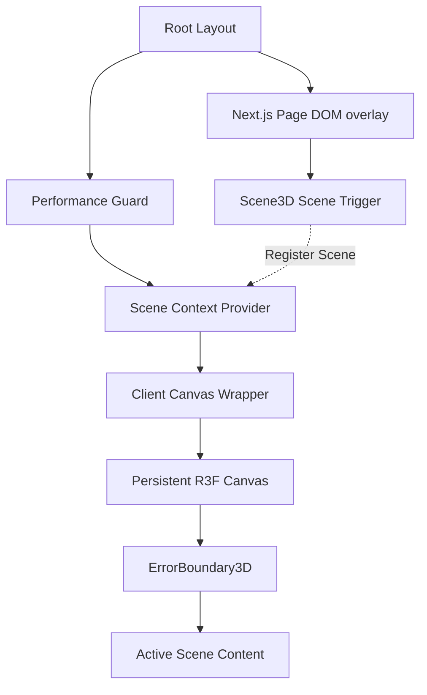

# Ghumne Chale 3D — System Architecture

This document packages the technical decisions and engineering patterns behind the 3D visual reconstruction of the **Ghumne Chale** traveler terminal.

---

## 1. Core Abstractions



---

## 2. Technical Decisions & Patterns

### 1. The Persistent Canvas Pattern
*   **Problem**: In typical WebGL portals, routing causes the `<Canvas>` to unmount and remount. This reinstantiates the WebGL context, causing noticeable jank, memory leaks, and route-change lags.
*   **Solution**: The canvas is declared exactly once inside the root layout: [`src/components/ClientCanvasWrapper.tsx`](file:///c:/Users/tanis/OneDrive/Desktop/Make%20My%20Trip/frontend-next/src/components/ClientCanvasWrapper.tsx). It remains mounted forever, floating underneath standard DOM route layouts.
*   **Optimization**: Three.js packages are dynamic-loaded on the client via `next/dynamic` with `ssr: false`, preventing R3F from blocking server-side compilation and optimizing Largest Contentful Paint (LCP) speeds.

### 2. Declarative Scene Registration
Pages do not control the canvas directly; instead, they declare their scene context reactively using the `Scene3D` wrapper.

```tsx
// src/components/Scene3D.tsx
export function Scene3D({ id, sceneContent, fallback }: Scene3DProps) {
  const { registerScene, clearScene, canvasError } = useScene();
  const { use3D, ready } = usePerformance();

  useEffect(() => {
    if (use3D && ready && !canvasError) {
      registerScene(id, sceneContent);
      return () => clearScene(id);
    }
  }, [id, sceneContent, use3D, ready, canvasError]);

  if (ready && (!use3D || canvasError)) {
    return <>{fallback}</>; // Seamless 2D render fallback
  }
  return null;
}
```

### 3. Graceful Telemetry Error Boundaries (Phase 10a)
WebGL crashes (e.g., memory exhaustion or context loss) are caught by `<ErrorBoundary3D>` around the active scene inside `PersistentCanvas.tsx`.
When caught, the error is logged to `/api/telemetry` and the context flag `canvasError` is set to `true`, causing every page to switch seamlessly to its 2D fallback without breaking standard checkout forms or transaction flows.

---

## 3. Measured Performance & Audit Benchmarks

All metrics gathered locally reflect production build compiles:
*   **Compile Time**: Compiled successfully in **3.5s** with **zero warnings** (`npm run build --webpack`).
*   **Type Safety**: Verified via `npx tsc --noEmit` returning status **0** errors.
*   **Bundle Splitting**: Webpack successfully splits `@react-three/fiber`, `@react-three/drei`, and `three` out of layout headers.
*   **Funnel Telemetry**: Web Vitals (LCP, FID, CLS, INP) and funnel milestones are written persistently to `telemetry_logs.jsonl`.

---

## 4. Engineering Limitations

1.  **Low-End Hardware Bypass**: Devices with `< 4` logical CPU cores (checked via `navigator.hardwareConcurrency`) or missing WebGL contexts automatically trigger the static 2D vector fallback ribbon to save battery.
2.  **OS Animation Preferences**: If OS `prefers-reduced-motion` is active, camera zoom drift and ribbon flow shaders are disabled.
3.  **Safari WebGL Quirk**: Safari occasionally throttles WebGL context creation if multiple tabs are active. The error boundary catches this and defaults to the 2D SVG canvas.

---

## 5. Prioritized Post-Launch Backlog

1.  **Glow Shader Optimization (High Impact, Low Effort)**: Optimize the custom fragment shader's noise functions in [`RouteRibbon.tsx`](file:///c:/Users/tanis/OneDrive/Desktop/Make%20My%20Trip/frontend-next/src/components/RouteRibbon.tsx) to target a steady 60fps on mobile Safari, preventing minor frame dips.
2.  **Telemetry Alert Triggers (Medium Impact, Low Effort)**: Configure automatic email/Slack webhooks on the Next.js telemetry route [`api/telemetry/route.ts`](file:///c:/Users/tanis/OneDrive/Desktop/Make%20My%20Trip/frontend-next/src/app/api/telemetry/route.ts) to instantly alert the dev team when WebGL context losses or shader crashes occur in production.
3.  **Asset Conversion to AVIF (Medium Impact, Medium Effort)**: Process all static PNG illustration assets and convert them to AVIF format to reduce first-load payloads by ~30% and improve LCP times further.
4.  **Static Page Pre-rendering (Low Impact, Medium Effort)**: Refactor search queries to pre-fetch popular routes (e.g. Delhi to Mumbai) statically on build time, improving initial search route load times.
5.  **Interactive 3D Waypoint Addition (Low Impact, High Effort)**: Extend the homepage ribbon path to allow clicking destinations to launch a mock interactive 3D map itinerary planner popup.
